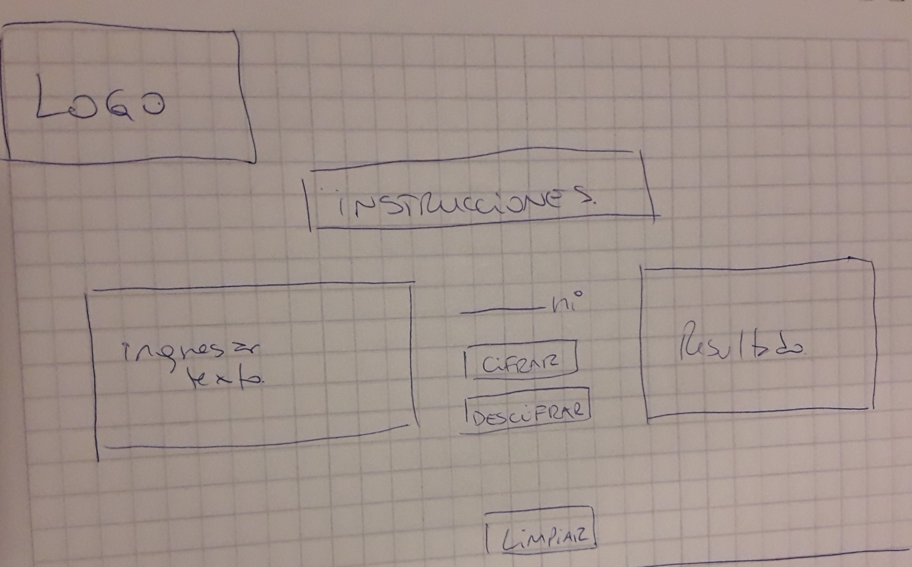
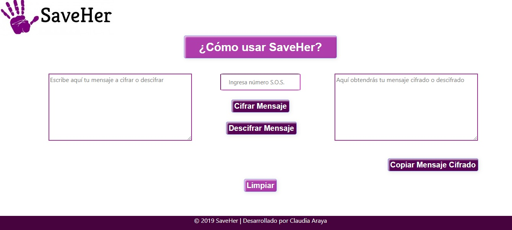

# SaveHer

Según cifras de la ONU, se estima que el 35% de las mujeres de todo el mundo ha sufrido violencia física y/o sexual por parte de un compañero sentimental. Durante el año 2017, se estima que alrededor de 44.000 mujeres fueron asesinadas por sus parejas o algún familiar, de esta cifra más de 30.000 mujeres en el mundo fueron asesinas, exclusivamente, por su actual o ex pareja. En Chile, durante el año 2018 se cometieron 60 femicidios. Por lo alarmante de estas cifras, es que distintas entidades, gubernamentales o privadas, se han movilizado de distintas formas y en distintas áreas para detener estos crímenes. Con la finalidad de aportar en el decremento de esta violencia, nace SaveHer. 

SaveHer está destinada, principalmente, a mujeres que sufren o han sufrido violencia física, verbal o sexual por parte de sus parejas. Esta plataforma permite cifrar mensajes, de manera anónima, para luego copiarlos y enviarlos a distintos destinatarios, le permite a la usuaria contar lo que está viviendo, sin que su agresor se entere, disminuyendo el miedo que siente la víctima a las represalias que este último podría ejercer contra ella. SaveHer, brinda una total y absoluta privacidad a la víctima, ya que una vez generado el mensaje cifrado, este se borra y no queda registro de el. Además permite al receptor del mensaje, descifrar el texto y así enterarse de lo qué está sucediendo con la víctima y poder brindarle apoyo y ayuda.

## Modo de uso

SaveHer posee dos herramientas principales: Cifrar y Descifrar un mensaje.

Para Cifrar un mensaje se requieren los siguientes pasos:
  - En el cuadro que se encuentra a la izquierda de la pantalla, escribe el mensaje que la usuaria quiera cifrar, no puede usar ñ, ni vocales acentuadas.
  - En el cuadro de al medio elige un número S.O.S., que deberá compartir con la persona que reciba el mensaje
  - Luego presiona el botón "Cifrar Mensaje".
  - En el cuadro de la derecha obtendrá su mensaje cifrado.
  - Luego presiona el botón "Copiar Mensaje Cifrado" y compartirlo con quien desee, junto al número S.O.S.
  - Finalmente presiona el botón "Limpiar" para borrar cualquier registro del mensaje ingresado.

Para Descifrar un mensaje se requieren los siguientes pasos:
  - En el cuadro que se encuentra a la izquierda de la pantalla, el usuario, escribe el mensaje, entregado por la víctima para descifrarlo.
  - En el cuadro de al medio debe ingresar el número S.O.S. entregado por la víctima.
  - Luego presiona el botón "Descifrar Mensaje".
  - En el cuadro de la derecha obtendrá su mensaje descifrado, listo para leer.

## Proceso y decisiones de diseño

En un principio se planificó cada tarea a realizar, las cuales se registraron en el siguiente link de la web Trello: [Trello Cifrado César](https://trello.com/b/8t8aHm83/cifrado-c%C3%A9sar).

Se optó por un diseño minimalista, de solo una pantalla,pensando en la urgencia con la cual la usuaria necesita acceder a la información. Además se eligió el color purpura para las terminaciones, haciendo referencia al color del feminismo y la sororidad que entrega este movimiento.

El proceso de construcción parte con un prototipo de baja fidelidad, donde se visualiza como debe quedar la plataforma:

## Test de usuario

Se hicieron testeos sobre la usabilidad de la plataforma, las usuarias testeadas fueron mujeres entre los 25 y 37 años. Los que quedaron registrados en los siguientes links:
- [Testeo de usuario 1](https://youtu.be/0EQ0BI4vhoA)
- [Testeo de usuario 2](https://youtu.be/q-uZ0SEpwUw)
- [Testeo de usuario 3](https://youtu.be/LwNlfChfze8)

En general, los test concluyeron que faltaba información sobre el uso de la plataforma, por esto se modificó el botón de instrucciones, haciéndolo más completo, llamativo y de fácil acceso. Además sugirieron hacer cambios en el resto de los botones para hacerlos más entendibles y vistosos.

El producto terminado quedó finalmente de la siguiente manera: 

